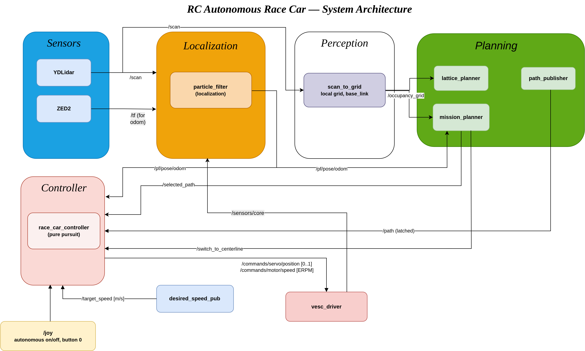

# RC Autonomous Race Car — ROS 2 Workspace

Autonomous driving stack for a 1/10-scale RC race car running on an
**NVIDIA Jetson Xavier (16 GB)** with a YDLidar, a VESC motor controller
and a particle-filter localization against a pre-built map.

Targets **ROS 2 Foxy** on the car; also builds on Humble (the tf2 include
deprecation warning on Humble is expected and harmless).

## System architecture



Editable source: [`system_architecture.drawio`](docs/architecture/system_architecture.drawio)

- **path_publisher / desired_speed_pub** (`v_ref_gen`) — publish the global
  centerline (`/path`, latched) and the speed reference (`/target_speed`,
  **m/s**) computed from path curvature/lateral error.
- **scan_to_grid / mission_planner / lattice_planner** (`lattice_planner_pkg`)
  — local obstacle avoidance. The mission planner watches a corridor around
  the centerline; on obstruction the lattice planner generates laterally
  offset spline candidates and `/selected_path` deviates around the
  obstacle, otherwise the centerline is forwarded. See
  `lattice_planner_pkg/README.md`.
- **race_car_controller** (`rc_pure_pursuit`) — pure pursuit tracking of
  `/selected_path` with speed-adaptive lookahead, expressed in the real
  vehicle parameters (wheelbase 0.28 m, max steer 29.85°). See
  `rc_pure_pursuit/race_car_controller/README.md`.
- **particle_filter**, **slam_toolbox** — localization / mapping.
- **vesc**, **ydlidar_ros2_driver** — hardware drivers.
- **race_car_launcher** — top-level launch files.

## Units convention

**All speeds in the stack are m/s.** ERPM appears only at the VESC
boundary; the controller converts using the measured drivetrain
(`race_car_parameters.txt`):

```
ERPM = v · 60 · (motor_poles/2) · gear_ratio / (2π · wheel_radius)
     = v · 3365.4        (14 poles, gear 2.769, wheel r = 0.055 m)
```

Note: VESC ERPM is electrical RPM = mechanical RPM × pole **pairs**.
Reference points: 2000 ERPM ≈ 0.6 m/s (slow walk), 3000 ≈ 0.9, 6000 ≈ 1.8.

## Build (Jetson Xavier)

```bash
cd ~/racecar_ws
sudo apt update && rosdep update rosdep install --from-paths src --ignore-src -r -y
colcon build --symlink-install --cmake-args -DCMAKE_BUILD_TYPE=Release
source install/setup.bash
```

Notes:
- `lattice_planner_pkg` and `race_car_controller` default to Release even
  without the flag; passing it makes every package optimized. An
  unoptimized build is the most common cause of the stack feeling slow.
- If RAM pressure kills the compiler on the Jetson, limit parallelism:
  `colcon build --parallel-workers 2 --executor sequential`.

## Run

```bash
# 1. Hardware (lidar + VESC + joystick)
ros2 launch race_car_launcher drivers.launch.py

# 2. Autonomy (localization + path/speed refs + controller + Obstacle Avoidance)
ros2 launch race_car_launcher autonomous.launch.py
```

Joystick button 0 toggles autonomous mode (0.5 s debounce). While off, the
controller streams neutral servo / zero speed.

## Tuning quick reference

| What | Where | Note |
|---|---|---|
| Steering feel | `steering_gain` in `rc_pure_pursuit/.../config/params.yaml` | 2.35 = tuned-on-track response; 1.0 = pure geometric pure pursuit |
| Speed range | `min/max_speed` in `v_ref_gen/path_publisher/config/params.yaml` | m/s; PD output effectively spans [min, (min+max)/2] |
| Lookahead | `lookahead_distance`, `min/max_look_ahead_distance` (controller) | Ld scales with commanded speed |
| Obstacle sensitivity | `obstacle_threshold`, `path_width` (mission_planner) | corridor checked ahead of the car |
| Avoidance offsets | `candidate_offsets` (lattice_planner) | lateral spline goals, meters |
| Obstacle inflation | `inflation_radius` (scan_to_grid) | keep ≥ half vehicle width (0.158 m) |

Vehicle measurements live in `race_car_parameters.txt`.
